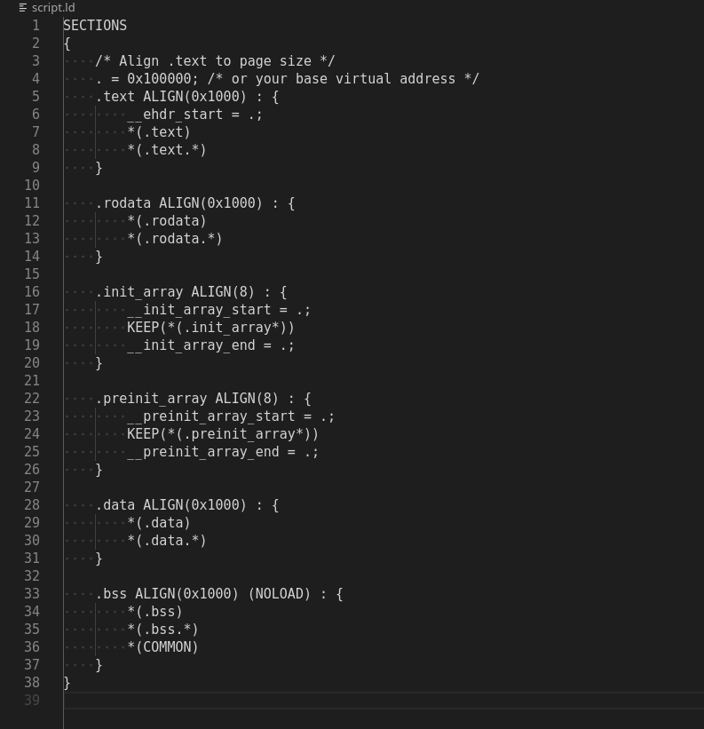
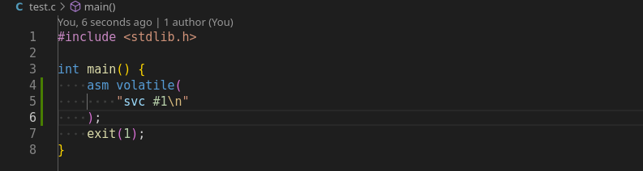
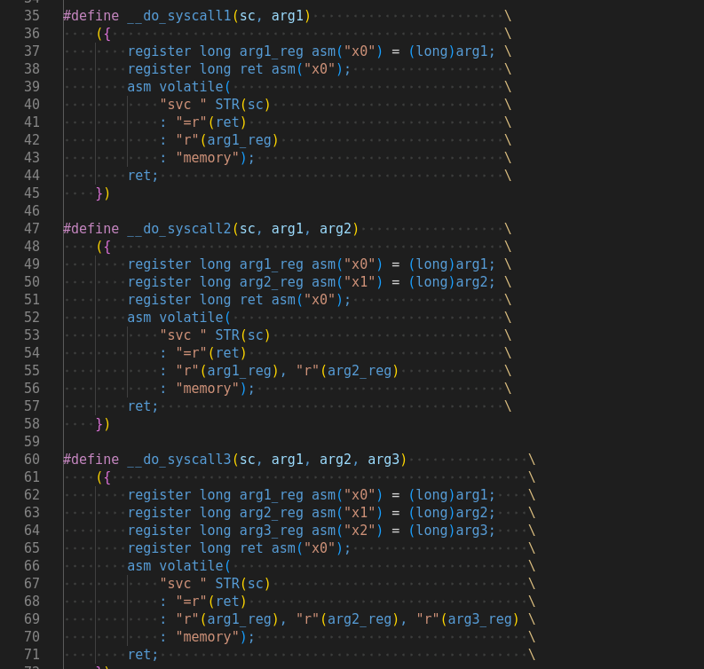
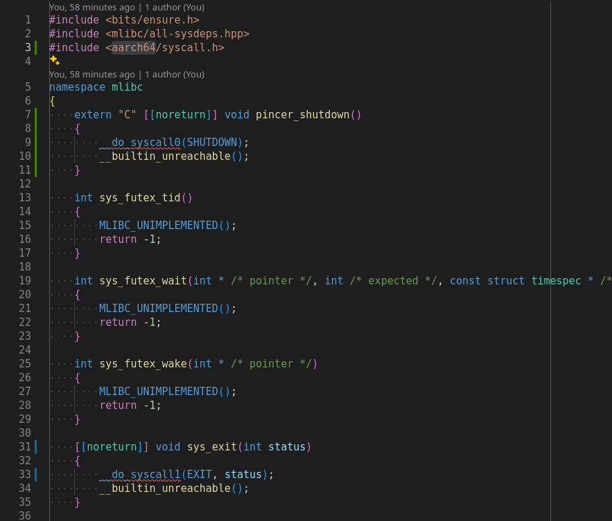
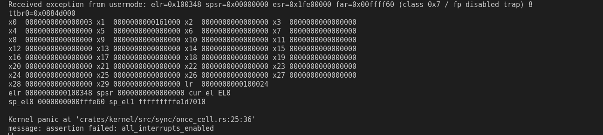
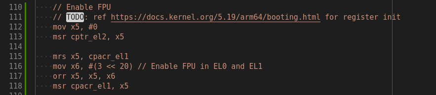

## Overview

After getting a reliable build process and all of the required functions stubbed out, it was time to start getting it to work with our OS.

## Loading from the PincerOS Kernel

1. The first step in this process is just to see if I can load the statically linked binary from before using the PincerOS kernel. I follow the instructions to add it to the init filesystem on a branch with an early version of the shell. I try running the application from the shell, but it causes a kernel panic. On further investigation, it is due to the fact that the executable has a LOAD segment with a virtual address which is not aligned to the page size.

    
    

2. I've never written a linker script before, so I use ChatGPT to help me with it. It takes a few iterations to get it right, but eventually I wind up with one that works. Adding the linker script to the compile command for the test program allows it to be successfully loaded by the kernel. The test program is then able to manually call the shutdown syscall using the `svc` instruction!

    
    
    

3. Now I am ready to begin implementing the syscall wrapper functions. I start with shutdown and exit, since they are pretty straightforward. I define some constants for the syscall numbers and some macros for inline assembly to issue syscalls in a new `include/aarch64/syscall.h` file within the pinceros sysdep.

    
    

4. I keep going with adding new syscalls to libc. Eventually, I get to `openat`, which triggers a trap whenever I try to run a program that calls it. It turns out that `openat` is a varargs function, which is compiled to use the NEON vector registers q0-q7. This trapped because the kernel does not enable the FPU. The change for this is a pretty simple 6 line change in `boot.rs` that has actually already been made on a different branch. However, this is an unsound change, since the registers are not saved/restored on a context switch. It could at least in theory be an issue on any context switch, but the one place where it really matters is when preempting the user process. Because processes can be scheduled to different cores at different points in time, if the process is using FPU registers at the moment it gets preempted, it will suddenly lose that state. (And as a side note is a security vulnerability since it leaks information to the next process to be scheduled on the original core).

    
    

5. Next I start working on the kernel code for setting up the stack when `exec`ing a user process. Having the experience of doing this for one of my 439H projects over a year and a half ago, it goes fairly quickly. Actually, most of my issues stem from still being somewhat unfamiliar with Rust and having to deal with the use of async callbacks in the kernel.
6. While helping Aaron ([@22aronl](https://github.com/22aronl/)) use the new argc and argv changes with Rust usermode programs (by putting argc and argv in registers for Rust, while also keeping them on the stack for C), I realize that the entry point for the test program I have been using is actually being set to `main`, rather than `_start`. This means that it was skipping the entire global constructor sequence, along with all of the internal initialization! Specifying the entry point in `compile.sh` fixes this, but starts causing many other issues.
    - The first issue was that the program seems to hang for about 15 seconds before a kernel panic in the allocator.
    - Merging in a more recent branch with updates to the allocator to be virtual memory-based, makes it so now it just hangs basically forever.
    - By strategically placing shutdown syscalls, I am able to narrow down where the issue is happening: in the initialization of `libraryPaths` within `interpreterMain` in the rltd `main.cpp` file. "But hold on, doesn't this sound like dynamic linking?" you may be asking. And you'd be correct. Yet again, the questionable design decisions to reuse logic between the dynamic linker and the static executable was causing me a massive headache, as it did earlier with the linker problems.
