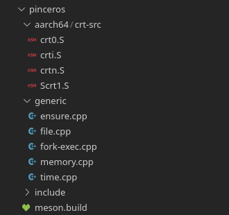
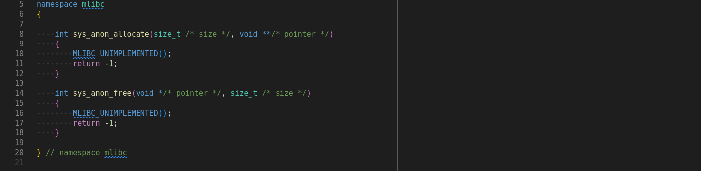
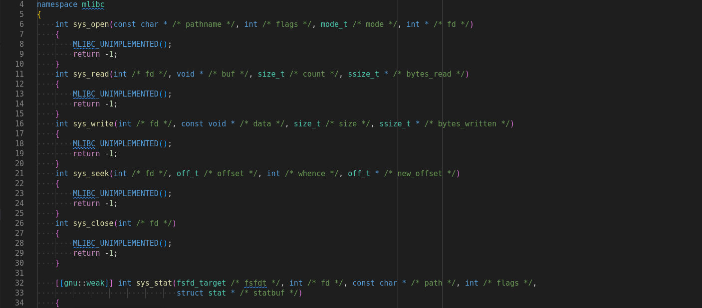
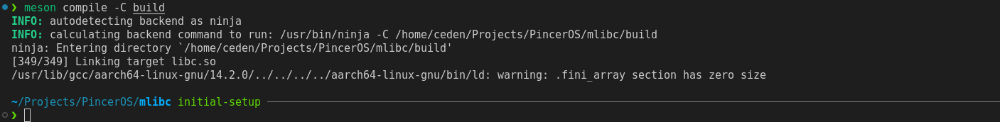
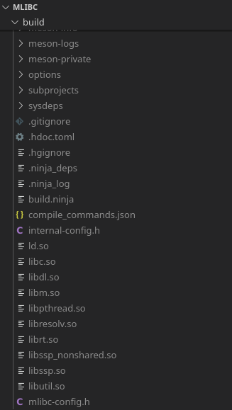
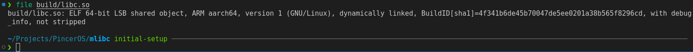
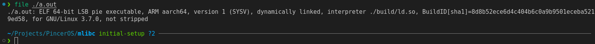
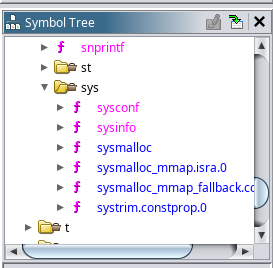
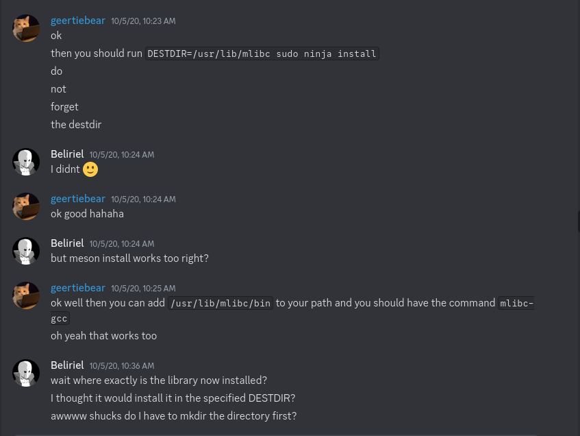
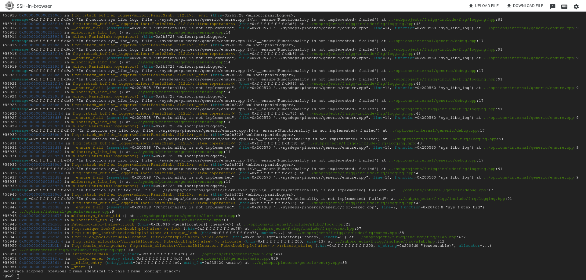

## Overview

Now that I was able to build mlibc, I needed to start actually implementing the things that it needs to function.

## Stubbing the Internal Dependencies

1. Now cautiously optimistic, I decide to stub out all of the functions that mlibc needs to work (and are giving me the linker errors), to at least make sure I can do that and resolve any issues, before I actually start implementing them. I mainly followed the Managarm version to find what it should all look like. And it did compile successfully! It successfully built several shared object files, including `libc.so` and `ld.so`. To double check everything, I ran `file build/libc.so` and was pleased to see that it was an ELF 64-bit shared object for aarch64.
    - Note that there it does say `warning: .fini_array section has zero size`. This is because I did not have any global destructors, and adding one makes the warning go away.






2. Now if I can just link with a sample program, it should pretty much just work [I thought optimistically]. I found a [StackOverflow answer](https://stackoverflow.com/a/5841817) on how to link with a different libc. It was as simple as `aarch64-linux-gnu-gcc -Xlinker -rpath=./build/ -Xlinker -I./build/ld.so test.c`! gcc exited with success, and the output file metadata looked good. But I couldn't easily test it, since I have an x86-64 machine. I could have probably gotten a Linux ISO and booted it up in QEMU, but at this moment I was running around campus working on my laptop, so the quicker thing to do was just use the few Google Cloud credits I had leftover from a cloud computing class and spin up an ARM VM for a few minutes to test with. But then I didn't really know how I'd get the shared library to work correctly on Linux, considering that it was built with a custom linker. So I ended up switching over to trying a static binary instead (by appending `-static` to the gcc command above). I uploaded the file and tried to run it in GDB on the ARM machine. But when I tried setting a breakpoint on `sys_exit` (I was just running a simple C program that immediately called `exit` which in mlibc calls `mlibc::sys_exit` defined by the sysdep), but there was no such symbol. Not completely trusting this, I loaded up the file in Ghidra, and sure enough none of the `sys_` symbols were there.




3. While previously, I had been using the `meson setup` option for mlibc `-Ddefault_library=both`, to build both shared and static libraries, but I decided to focus on static libraries to try to get that part working first. So now I run `meson setup build --cross-file scripts/aarch64-pinceros-gcc.txt --reconfigure -Ddefault_library=static`, recompile mlibc, and try to link with the test program again. However, this yields a massive wall of undefined reference linker errors, to mainly what seem to be functions relating to floating point and atomic operations.

4. At this point, I joined the Managarm Discord server using the link in the README to see if anyone had encountered similar issues before. I searched for "undefined reference to __dso_handle" since that was in the first error. I eventually see a conversation from October 5, 2020 between @geertiebear and @Beliriel which made me think to try installing after compiling. So I run `meson install -C build --destdir=./install`

5. Now after installing, when I try to link I get a different set of undefined reference linker errors, which are almost entirely related to atomic instructions. Which seems like an improvement from before.

6. At this point, I felt like I was just going in circles, so I decided to give clang another try. I'm going to omit the majority of this because it ended up being a dead end, but basically I cloned the `llvm-project` repo and tried building `compiler-rt` and using `clang` for everything. It did not end up well for me.
7. After that failed, I decided that instead of trying to use gcc for both libc and the test program, what if I used gcc for libc and clang for the test program? First I had to create some stubs for the undefined references (they wouldn't behave correctly but I just wanted to be able to build it). It was able to successfully build without linker errors. When I ran it on the ARM VM, there was a stack overflow, but the good news is that I observed that it was clearly running with mlibc by looking at the stack trace! (The `__ensure_fail` function and the logging system were mutually recursively calling each other, since the logger was stubbed out with the `MLIBC_UNIMPLEMENTED` macro which ensures failure, which includes logging, and so on)


## Simplifying the Build Process

1. So now that I have it working with a combination of gcc and clang, I want to try to get it working all under the roof of one compiler toolchain. There was lots of basically just trial and error over the span of a couple weeks, trying various combination of compiler and linker flags. For some of my more notable attempts, see the commented out portions of `compile.sh` at [this commit on GitHib](https://github.com/pincerOS/mlibc/commit/81a3fee6f7d1b2af4847fa9d2a07b067d41ea566).
2. Eventually I synced up with Alex ([@ameyer1024](https://github.com/ameyer1024/)) who had some prior work getting Newlib to work for porting DOOM. His main suggestions were to separate out the compiling and building into two separate commands, and to be sure to specify all of the paths manually to make sure the compiler and linker finds everything correctly. Eventually I ended up with the following (which is the uncommented portion of `compile.sh` in the commit above):

    ```sh
    aarch64-linux-gnu-gcc -c test.c -I./build/install/usr/local/include
    aarch64-linux-gnu-ld -nostdlib test.o -L./build/install/usr/local/lib -static \
        -o a.out \
        ./build/sysdeps/pinceros/crt0.o ./build/sysdeps/pinceros/crti.o \
        -lc /usr/lib/gcc/aarch64-linux-gnu/14.2.0/libgcc.a 
    ```

3. While this resolved the majority of the linker errors, I had to so some slightly cursed special handling for `__getauxval` and `__dso_handle`. Despite being in a static build (which you would assume wouldn't need these since they relate to dynamic linking), the resulting binary still had references to them. I am not sure if this is due to the slightly questionable way that mlibc reuses dynamic linker logic in static builds, or if libgcc is just being weird here. For `__getauxval`, I had to edit some conditional compilation by adding my own `defined(PINCEROS)`, along with the corresponding `-DPINCEROS` in the cross compilation file, and hardcoding `__getauxval` to return 0, since our kernel does not supply an auxiliary vector. For `__dso_handle`, I just made an assembly file that defines it as a global quad (aka a pointer), and added that file to the `meson.build`. Now, building the test program with mlibc and running it on the ARM VM works (or at least gets to the stack overflow), without even having to stub out a bunch of builtins!
