## Overview

Now that I had picked mlibc as the implementation to port, and release-5.0 as the version, it was time to start working. I forked the GitHub repository to the PincerOS organization ([pincerOS/mlibc](https://github.com/pincerOS/mlibc)), and cloned it to my local machine.

## Starting the Port

1. Following the instructions in the README, I create a new `sysdeps` subdirectory, `pinceros`. I add an empty `meson.build` file, and then add a new entry to the top-level `meson.build` file to register the new sysdep, following the pattern of the other ports.
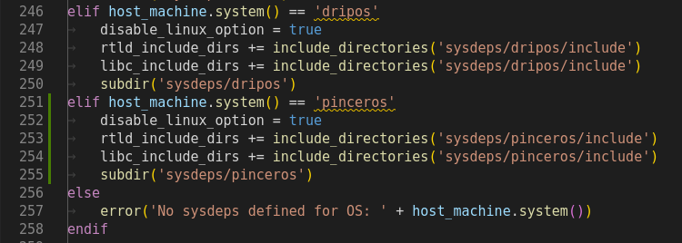
2. Then to verify that the new sysdep was being recognized, I try to `meson build` and just see what would happen. I get errors about `linux_kernel_headers` not being set, and scrolling up in the terminal, it looks like it was compiling for x86-64, rather than Aarch64. I had forgotten to configure meson to build for our system!
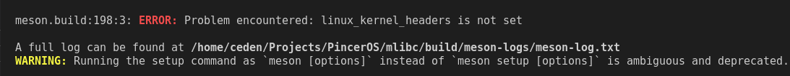
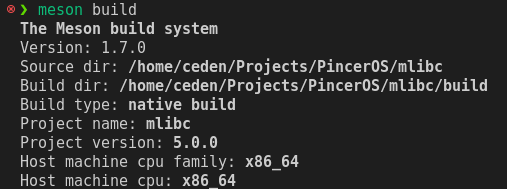
3. To fix this, I create a cross compile configuration file, and tell meson about it by running `meson setup build --cross-file aarch64-pinceros.txt`.
    - I eventually end up moving the file to the `scripts` directory, and renaming it to differentiate between compilers, but more on that later.
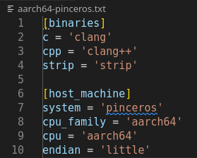
4. Now, there is a new error, but at least it lists the right host machine information. The error reports a directory not existing, which I resolve by simply creating an empty directory at that location. So now `meson setup` succeeds.
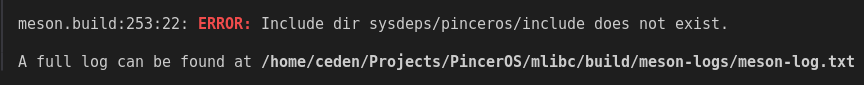
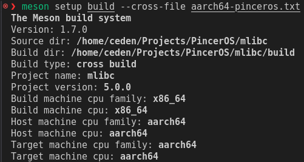
    - As a side tangent, I noticed a list titled "Subprojects" which listed `cshim`, `cxxshim`, and `frigg`. Out of curiosity, I looked into the Managarm GitHub and found the repos for each of them.
      - [cshim](https://github.com/managarm/cshim) is "a collection of freestanding C headers, for use with GCC or Clang." It contains header files such as `stdint.h`, `stddef.h`, `stdbool.h`, and `stdarg.h`, which define types and macros, but not functions.
      - [cxxshim](https://github.com/managarm/cxxshim) is similar, but for C++. It contains header files such as `algorithm`, `cstddef`, `cstdint`, `iterator`, `memory`, `new`, `type_traits`, and `utility`.
      - [frigg](https://github.com/managarm/frigg) provides "lightweight C++ utilities and algorithms for system programming" and contains many header files, including `mutex.hpp`, `optional.hpp`, and `unique.hpp`.
5. Now that meson setup works, I try compiling with `meson compile -C build`. There are lots of build errors because I have not yet created the ABI header files.
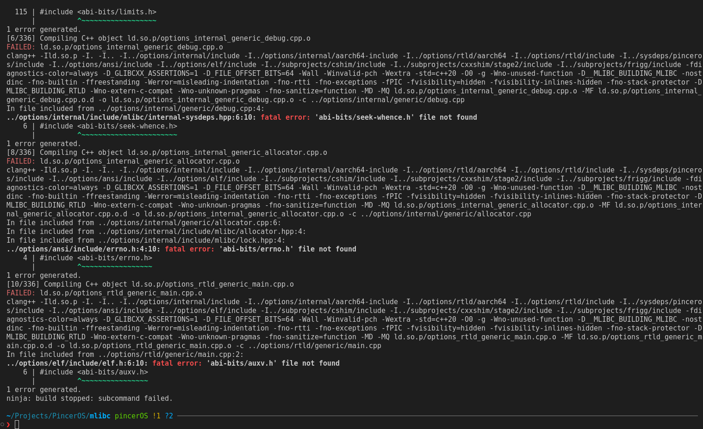

## Getting mlibc to Build

1. Following the instructions in the README, I know I have to create all of the ABI header files in the `abis` directory and create a symlink to each of them in `sysdeps`. There are a lot of them (45), so it would be kind of painful to do manually. There is a script in the `scripts` directory called `abi-link.sh`, but all it does is create the symlinks, not the actual header files themselves. At this point in time while I'm setting up mlibc, we don't have a very fleshed out syscall ABI in our OS, so we do not have anything to put in the header files. But I know that there were specific named constants that have to be defined in each of them for mlibc to work, so I decide to just write a new script to copy the Linux headers and generate the symlinks, at `scripts/gen-abi-bits.py`.
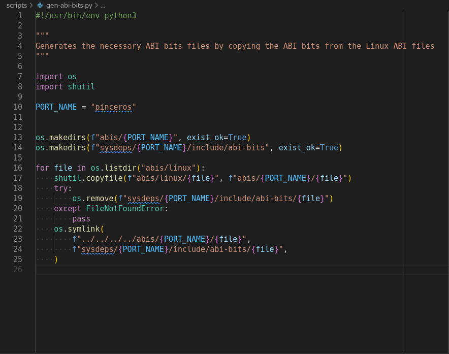
2. Now, I get compiler errors relating to invalid instruction mnemonics, so despite providing the cross compile file, there is still something wrong with it. I update the cross file to not only set the cpu, but also pass the triple target argument `--target=aarch64-none-elf` into clang using `c_args` and `cpp_args`.
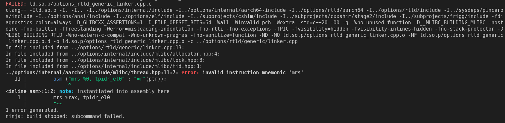
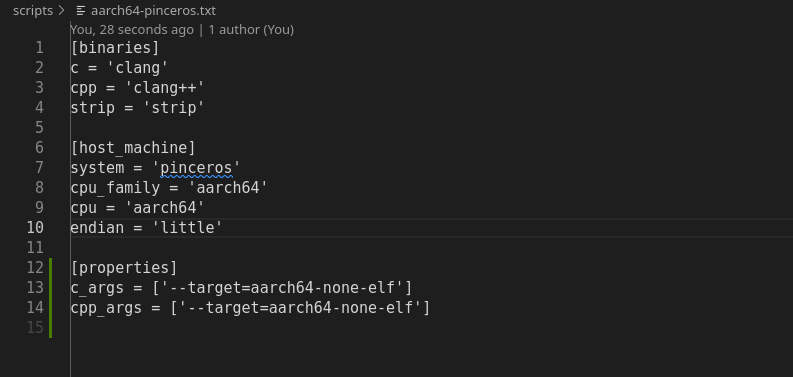
3. But now we're back to failing meson setup...
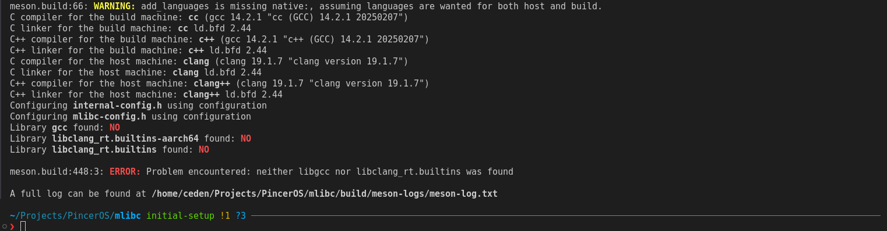
4. I notice in the logs that it is failing to find `ld.lld`, so I try installing it. And get errors from `ld.lld` being unable to find `libclang_rt.builtins`, `lc`, and `lm`. I do have `compiler-rt` on my Linux system for x86-64, but not for Aarch64. I search for it in the Arch Linux package repository and in the AUR, but the only results I see are for armv6 and armv7, not for armv8/aarch64.
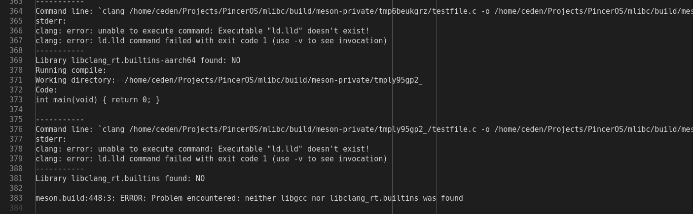

5. At this point I fear I will have to build llvm's `compiler-rt` from source (which I would prefer to not have to do), so I try pivoting to gcc first and see if I can make it further than with clang. So I install `aarch64-linux-gnu-gcc` and create a new cross compile file for it, `aarch64-pinceros-gcc.txt`.
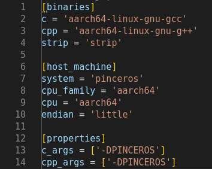
6. Now compiling yields a ton of undefined reference linker errors, which is actually a good sign because it means that it was at least able to compile everything, and then just fails to link because I have not provided any implementation for the necessary functions yet.
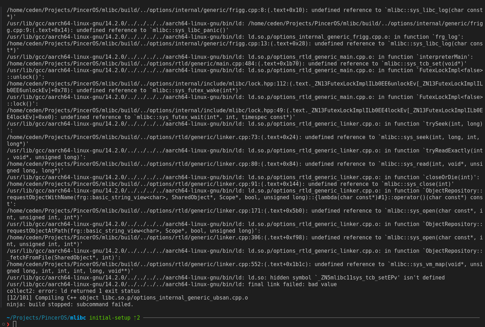
